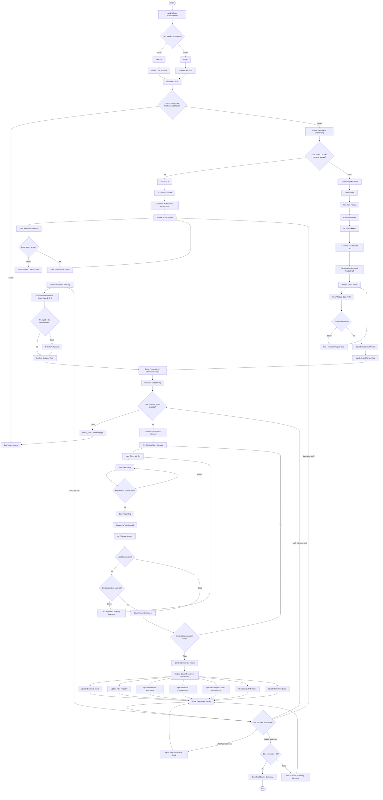

# Software Requirements Specification (SRS)
# Road2Work.id — Updated Version

**Project Name:** Road2Work.id  
**Product Type:** AI Career Readiness Platform  
**Tagline:** Your Roadmap to a Better Career  
**Version:** 2.0  
**Prepared for:** Capstone Project  
**Main Focus MVP:** Professional Profile, Role Fit, Adaptive Voice Interview, Career Readiness Dashboard, dan Admin Panel Basic  

---

## 1. Pendahuluan

### 1.1 Tujuan Dokumen

Dokumen Software Requirements Specification (SRS) ini dibuat untuk mendefinisikan kebutuhan sistem Road2Work.id versi terbaru secara detail, terstruktur, dan dapat dijadikan acuan oleh seluruh tim pengembang, termasuk Frontend, Backend, AI Engineer, Data Scientist, QA, dan Project Manager.

SRS ini bertujuan untuk:

1. Menjelaskan ruang lingkup sistem Road2Work.id.
2. Mendefinisikan kebutuhan fungsional dan non-fungsional.
3. Menjelaskan flow terbaru berdasarkan hasil meeting tim.
4. Menjadi acuan pengembangan frontend, backend, AI service, database, dan admin panel.
5. Mengurangi miskomunikasi antar role teknis.
6. Menjadi dasar testing, integrasi, deployment, dan demo capstone.

---

### 1.2 Deskripsi Produk

Road2Work.id adalah platform **AI Career Readiness** yang membantu mahasiswa, fresh graduate, career switcher, dan pencari kerja mempersiapkan diri menuju dunia kerja secara lebih terarah.

Pada MVP capstone ini, Road2Work.id berfokus pada proses:

```txt
Profile → Role → Practice → Feedback → Improve
```

User dapat membangun profil profesional melalui upload CV atau isi profil manual. Sistem akan membaca skill, tools, bukti pengalaman, dan sinyal pencapaian user. Setelah itu, sistem membantu user memilih atau memahami role target, membangun konteks interview, menjalankan adaptive voice interview, mengevaluasi jawaban, dan memperbarui Career Readiness Dashboard.

Road2Work.id bukan hanya aplikasi mock interview, tetapi diarahkan sebagai platform career roadmap yang membantu user memahami posisi mereka saat ini, melihat gap yang perlu diperbaiki, dan mengambil langkah berikutnya sebelum melamar kerja.

---

### 1.3 Filosofi Produk

Nama Road2Work.id menggambarkan perjalanan user menuju dunia kerja.

```txt
Road = perjalanan / roadmap
2 = arah menuju tujuan
Work = pekerjaan / karier
.id = identitas Indonesia
```

Filosofi utama Road2Work.id:

```txt
Discover → Prepare → Practice → Improve → Apply
```

Untuk MVP, fokus utama ada pada:

```txt
Prepare → Practice → Improve
```

Artinya, sistem membantu user untuk:

1. Membangun profil profesional.
2. Memahami role yang sesuai.
3. Melatih interview berbasis suara.
4. Mendapat feedback AI yang actionable.
5. Melihat prioritas perbaikan melalui dashboard.

---

### 1.4 Scope MVP

Scope MVP Road2Work.id versi terbaru meliputi:

1. Landing Page.
2. Login dan Sign Up.
3. Readiness Hub.
4. Career Readiness Onboarding.
5. Upload CV Path.
6. Manual Profile Path.
7. AI Profile Extraction.
8. Review & Edit Professional Profile.
9. Role Fit Ranking untuk jalur CV.
10. Role Fit Score untuk dashboard.
11. Confirm Selected Role.
12. Build Personalized Interview Context.
13. Interview Onboarding.
14. Adaptive Voice Interview.
15. Speech-to-Text.
16. AI Answer Evaluation.
17. Clarifying Question.
18. Interview Result.
19. Career Readiness Dashboard.
20. Interview Free Quota.
21. Admin Panel Basic.
22. CRUD Domain, Role Family, dan Role.
23. Admin Analytics Dashboard sederhana.
24. FastAPI AI Service.
25. PostgreSQL Database.
26. Streamlit Data Science Dashboard.

---

### 1.5 Out of Scope MVP

Fitur berikut tidak masuk ke dalam MVP capstone:

1. Job portal real-time.
2. Apply job langsung ke perusahaan.
3. Payment/subscription.
4. Live AI avatar dengan lip sync.
5. Webcam analysis.
6. Emotion detection.
7. Mentor marketplace.
8. Full CV builder.
9. Company-specific interview pack.
10. Native mobile app.
11. Advanced admin audit log.
12. Advanced permission management.
13. Advanced job recommendation.

---

### 1.6 Definisi Istilah

| Istilah | Definisi |
|---|---|
| User | Pengguna Road2Work.id. |
| Admin | Pengelola data domain, role family, role, user, dan analytics. |
| Professional Profile | Profil profesional user yang berisi ringkasan, skill, tools, evidence, dan achievement. |
| CV Path | Jalur onboarding ketika user upload CV. |
| Manual Path | Jalur onboarding ketika user tidak upload CV dan mengisi profil manual. |
| Domain | Kategori besar bidang karier, misalnya Information Technology. |
| Role Family | Keluarga role dalam domain, misalnya Data & AI atau Software Engineering. |
| Role | Target pekerjaan spesifik, misalnya Product Analyst atau Backend Developer. |
| Role Fit Ranking | Ranking role yang direkomendasikan AI, hanya untuk jalur CV. |
| Role Fit Score | Skor kecocokan user terhadap satu role tertentu. |
| Evidence Score | Skor kekuatan bukti pengalaman user. |
| Profile Completeness | Skor kelengkapan profil user. |
| Interview Readiness | Skor kesiapan interview berdasarkan sesi latihan. |
| Career Readiness Score | Skor gabungan yang menunjukkan kesiapan user untuk melamar kerja. |
| Adaptive Voice Interview | Interview berbasis suara yang dapat menyesuaikan pertanyaan berdasarkan jawaban user. |
| Clarifying Question | Pertanyaan lanjutan AI jika jawaban user masih kurang jelas atau kurang evidence. |
| STT | Speech-to-Text, proses mengubah suara menjadi teks. |
| GenAI | Generative AI yang digunakan untuk pertanyaan, evaluasi, klarifikasi, dan feedback wording. |

---

## 2. Gambaran Umum Sistem

### 2.1 Product Perspective

Road2Work.id adalah aplikasi web berbasis AI yang terdiri dari beberapa komponen utama:

1. **Frontend Web Application**  
   Menyediakan UI untuk landing page, onboarding, profile review, role fit, interview stage, dashboard, dan admin panel.

2. **Backend API Gateway**  
   Menangani authentication, authorization, user, profile, domain, role, interview session, dashboard, quota, dan komunikasi ke AI service.

3. **FastAPI AI Service**  
   Menangani CV extraction, manual profile extraction, role fit ranking, role fit score, question generation, STT, answer evaluation, clarification, dan interview result generation.

4. **PostgreSQL Database**  
   Menyimpan data user, profile, role taxonomy, interview session, answer, result, dashboard, dan admin-managed data.

5. **Data Science Layer**  
   Menyediakan dataset, skill taxonomy, role-skill matrix, EDA, fit score logic, dan dashboard Streamlit.

---

### 2.2 High-Level Architecture

```txt
User Browser
↓
Next.js Frontend
↓
Express.js Backend API Gateway
↓
PostgreSQL Database
↓
FastAPI AI Service
↓
GenAI / TensorFlow / STT Engine
```

Frontend tidak boleh langsung memanggil FastAPI AI Service. Semua request AI harus melalui backend.

---

### 2.3 Core Loop Produk

```txt
Profile
↓
Role
↓
Practice
↓
Feedback
↓
Improve
```

Penjelasan:

1. User membangun profil profesional.
2. User memilih atau menerima rekomendasi role.
3. User melakukan adaptive voice interview.
4. Sistem memberikan feedback dan result.
5. Dashboard memberi next best action agar user bisa memperbaiki kesiapan.

---

## 3. User Role dan Stakeholder

### 3.1 User

User adalah mahasiswa, fresh graduate, career switcher, atau pencari kerja.

Kebutuhan utama user:

1. Mengetahui kesiapan diri sebelum melamar kerja.
2. Membuat profil profesional yang lebih jelas.
3. Mendapat rekomendasi role yang sesuai.
4. Melatih interview berbasis voice.
5. Mendapat feedback yang spesifik dan actionable.
6. Mengetahui gap yang perlu diperbaiki.

---

### 3.2 Admin

Admin adalah pengelola sistem Road2Work.id.

Kebutuhan admin:

1. Mengelola domain.
2. Mengelola role family.
3. Mengelola role.
4. Mengelola skill/tools per role.
5. Melihat user management.
6. Melihat analytics sederhana.

---

### 3.3 Project Manager

Bertanggung jawab menjaga scope MVP, prioritas fitur, flow produk, dan koordinasi antar role.

---

### 3.4 Frontend Developer

Bertanggung jawab mengimplementasikan UI/UX dan integrasi API.

---

### 3.5 Backend Developer

Bertanggung jawab membangun REST API, database, authentication, authorization, dan integrasi AI service.

---

### 3.6 AI Engineer

Bertanggung jawab membangun FastAPI, STT, AI extraction, evaluation, clarification, role fit, dan TensorFlow supporting model.

---

### 3.7 Data Scientist

Bertanggung jawab pada dataset, EDA, skill taxonomy, role-skill matrix, fit score logic, dan Streamlit dashboard.

---

## 4. Alur Sistem Terbaru

### 4.1 Flow Utama

Road2Work.id memiliki dua jalur onboarding utama:

1. **Upload CV Path**
2. **Manual Profile Path**

Perbedaan utama:

- Pada **Upload CV Path**, user belum memilih role dari awal, sehingga sistem membuat **Role Fit Ranking**.
- Pada **Manual Profile Path**, user memilih Domain → Role Family → Target Role terlebih dahulu, sehingga sistem tidak perlu membuat Role Fit Ranking.

---

### 4.2 Upload CV Path

```txt
Landing Page
↓
Login / Sign Up
↓
Readiness Hub
↓
Career Readiness Onboarding
↓
Upload CV
↓
AI Extract CV Data
↓
Generate Professional Profile Draft
↓
Review & Edit Profile
↓
User Validasi Data Profil
↓
Generate Role Fit Ranking
↓
Show Recommended Roles Rank 1, 2, 3
↓
User pilih role rekomendasi atau role manual
↓
Confirm Selected Role
↓
Build Personalized Interview Context
↓
Interview Onboarding
↓
Adaptive Voice Interview
↓
Interview Result
↓
Update Career Readiness Dashboard
```

---

### 4.3 Manual Profile Path

```txt
Landing Page
↓
Login / Sign Up
↓
Readiness Hub
↓
Career Readiness Onboarding
↓
Copywriting Disclaimer
↓
Pilih Domain
↓
Pilih Role Family
↓
Pilih Target Role
↓
Isi Profil Singkat
↓
AI Extract Short Profile Data
↓
Generate Professional Profile Draft
↓
Review & Edit Profile
↓
User Validasi Data Profil
↓
Use Selected Target Role
↓
Build Personalized Interview Context
↓
Interview Onboarding
↓
Adaptive Voice Interview
↓
Interview Result
↓
Update Career Readiness Dashboard
```

---

### 4.4 Activity Diagram Full



---

## 5. Kebutuhan Fungsional

Format requirement:

- **FR-XX** = Functional Requirement
- **Prioritas:** P0 / P1 / P2
- **MVP:** Ya / Tidak

---

## 5.1 Authentication

### FR-01 — Sign Up

**Deskripsi:**  
Sistem harus menyediakan fitur sign up agar user dapat membuat akun.

**Input:**

1. Nama.
2. Email.
3. Password.

**Output:**

1. Akun user dibuat.
2. Access token diberikan.
3. User diarahkan ke Readiness Hub.

**Acceptance Criteria:**

1. User dapat membuat akun dengan email valid.
2. Sistem menolak email yang sudah terdaftar.
3. Password tidak disimpan dalam plain text.
4. User baru mendapatkan free interview quota sebanyak 5 sesi.

**Prioritas:** P0  
**MVP:** Ya

---

### FR-02 — Login

**Deskripsi:**  
Sistem harus menyediakan fitur login.

**Input:**

1. Email.
2. Password.

**Output:**

1. User berhasil login.
2. Access token diberikan.
3. User diarahkan ke dashboard atau onboarding.

**Acceptance Criteria:**

1. Login berhasil jika credential valid.
2. Credential salah menampilkan error.
3. Protected endpoint tidak dapat diakses tanpa token.

**Prioritas:** P0  
**MVP:** Ya

---

### FR-03 — Get Current User

**Deskripsi:**  
Sistem harus dapat mengambil data user yang sedang login.

**Acceptance Criteria:**

1. Endpoint `/me` mengembalikan data user.
2. Response tidak menampilkan password hash.
3. Response menampilkan quota interview user.

**Prioritas:** P0  
**MVP:** Ya

---

## 5.2 Landing Page dan Readiness Hub

### FR-04 — Landing Page

**Deskripsi:**  
Sistem harus menampilkan landing page untuk menjelaskan value Road2Work.id.

**Section utama:**

1. Hero.
2. Problem.
3. Solution.
4. How It Works.
5. Features.
6. Team.
7. FAQ.
8. CTA.

**Acceptance Criteria:**

1. Landing page dapat diakses publik.
2. CTA mengarah ke login/sign up.
3. Desain sesuai brand guideline Road2Work.id.
4. Layout responsive.

**Prioritas:** P0  
**MVP:** Ya

---

### FR-05 — Readiness Hub

**Deskripsi:**  
Setelah login, user melihat halaman awal yang mengarahkan ke onboarding atau dashboard.

**Acceptance Criteria:**

1. Jika user belum punya professional profile, sistem mengarahkan ke onboarding.
2. Jika user sudah punya profile, sistem menampilkan dashboard utama.
3. User dapat memulai flow career readiness dari hub.

**Prioritas:** P0  
**MVP:** Ya

---

## 5.3 Domain, Role Family, dan Role

### FR-06 — Menampilkan Domain

**Deskripsi:**  
Sistem harus menampilkan daftar domain career.

**Acceptance Criteria:**

1. Domain tampil dari database.
2. Domain aktif saja yang ditampilkan ke user.
3. User dapat memilih satu domain pada manual path.

**Prioritas:** P0  
**MVP:** Ya

---

### FR-07 — Menampilkan Role Family

**Deskripsi:**  
Sistem harus menampilkan role family berdasarkan domain yang dipilih.

**Acceptance Criteria:**

1. Role family dapat difilter berdasarkan domain.
2. User dapat memilih satu role family.
3. Role family aktif saja yang ditampilkan.

**Prioritas:** P0  
**MVP:** Ya

---

### FR-08 — Menampilkan Target Role

**Deskripsi:**  
Sistem harus menampilkan target role berdasarkan role family yang dipilih.

**Acceptance Criteria:**

1. Role dapat difilter berdasarkan role family.
2. User dapat memilih satu target role.
3. Role yang dipilih disimpan pada manual profile.

**Prioritas:** P0  
**MVP:** Ya

---

## 5.4 Professional Profile Onboarding

### FR-09 — Menampilkan Pilihan Upload CV atau Manual Profile

**Deskripsi:**  
Sistem harus meminta user memilih apakah ingin upload CV atau mengisi profil manual.

**Acceptance Criteria:**

1. Sistem menekankan manfaat upload CV.
2. Sistem menyediakan alternatif isi profil manual.
3. Sistem menampilkan disclaimer privasi.
4. Wording tidak menggunakan “skip” atau “lanjut tanpa data”.

**Prioritas:** P0  
**MVP:** Ya

---

### FR-10 — Upload CV

**Deskripsi:**  
User dapat upload CV untuk diproses AI.

**Input:**

1. File PDF CV.

**Output:**

1. Professional profile draft.
2. Extracted skills.
3. Extracted tools.
4. Skill evidence.
5. Achievement signals.
6. Evidence score.
7. Profile completeness.

**Acceptance Criteria:**

1. Sistem hanya menerima format PDF.
2. Sistem membatasi ukuran file.
3. Sistem menampilkan error jika file invalid.
4. Sistem mengirim file ke AI service untuk extraction.
5. Sistem membuat professional profile draft.

**Prioritas:** P0  
**MVP:** Ya

---

### FR-11 — Manual Profile Input

**Deskripsi:**  
Jika user belum siap upload CV, user memilih domain, role family, target role, lalu mengisi profil singkat.

**Input:**

1. Domain ID.
2. Role Family ID.
3. Target Role ID.
4. Pengalaman paling relevan.
5. Skill dan tools.
6. Project experience.
7. Achievement atau impact.

**Output:**

1. Professional profile draft.
2. Selected role tersimpan.

**Acceptance Criteria:**

1. User wajib memilih target role sebelum isi profil singkat.
2. Sistem tidak membuat Role Fit Ranking pada manual path.
3. Sistem membuat professional profile draft dari input user.
4. Selected target role digunakan untuk interview context.

**Prioritas:** P0  
**MVP:** Ya

---

### FR-12 — AI Extract Professional Profile

**Deskripsi:**  
Sistem harus mengekstrak data profil dari CV atau profil manual.

**Data extraction:**

1. Professional summary.
2. Skills.
3. Tools.
4. Skill evidence.
5. Achievement signals.
6. Evidence score.
7. Profile completeness.
8. AI confidence.

**Acceptance Criteria:**

1. Output extraction berbentuk data terstruktur.
2. Extraction dapat digunakan untuk review profile.
3. Jika AI gagal, sistem menampilkan fallback error.
4. User tetap dapat mengedit hasil extraction.

**Prioritas:** P0  
**MVP:** Ya

---

### FR-13 — Review & Edit Professional Profile

**Deskripsi:**  
User harus dapat meninjau dan mengedit hasil AI extraction sebelum lanjut.

**Data yang dapat diedit:**

1. Ringkasan profesional.
2. Skills.
3. Tools.
4. Bukti per skill.
5. Sinyal pencapaian.

**Acceptance Criteria:**

1. User dapat menambah, mengubah, dan menghapus data profil.
2. Sistem menghitung ulang evidence score dan profile completeness setelah update.
3. User dapat menyimpan profile sebagai reviewed.
4. User dapat confirm profile sebelum lanjut.

**Prioritas:** P0  
**MVP:** Ya

---

## 5.5 Role Fit

### FR-14 — Generate Role Fit Ranking untuk CV Path

**Deskripsi:**  
Sistem harus membuat ranking role yang cocok berdasarkan profil user pada jalur upload CV.

**Business Rule:**

1. Hanya berlaku untuk profile dengan source `cv`.
2. Tidak dipakai pada manual path.

**Output:**

1. Rank 1 role.
2. Rank 2 role.
3. Rank 3 role.
4. Fit score.
5. Reason.
6. Strengths.
7. Gaps.
8. Skill overlap.

**Acceptance Criteria:**

1. Sistem menampilkan maksimal 3 role recommendation.
2. Setiap role memiliki alasan rekomendasi.
3. User dapat memilih role rekomendasi.
4. User dapat memilih role manual jika tidak setuju dengan rekomendasi.

**Prioritas:** P0  
**MVP:** Ya

---

### FR-15 — Calculate Role Fit Score

**Deskripsi:**  
Sistem harus menghitung kecocokan user terhadap role yang dipilih.

**Business Rule:**

1. Berlaku untuk CV path dan manual path.
2. Dipakai untuk dashboard utama.

**Acceptance Criteria:**

1. Role Fit Score berada pada range 0–100.
2. Score memiliki alasan.
3. Score menjelaskan matched skills dan missing skills.
4. Score dapat diperbarui jika profile diedit.

**Prioritas:** P0  
**MVP:** Ya

---

### FR-16 — Confirm Selected Role

**Deskripsi:**  
Sistem harus menyimpan role final yang dipilih user sebelum interview.

**Acceptance Criteria:**

1. Profile memiliki `selectedRoleId` sebelum interview.
2. Pada CV path, user wajib confirm role.
3. Pada manual path, selected role berasal dari pilihan user di awal.
4. Interview tidak dapat dimulai tanpa selected role.

**Prioritas:** P0  
**MVP:** Ya

---

## 5.6 Interview Onboarding dan Quota

### FR-17 — Interview Onboarding

**Deskripsi:**  
Sebelum interview, sistem menampilkan aturan interview.

**Informasi yang ditampilkan:**

1. Target role.
2. Jumlah pertanyaan.
3. Cara menggunakan microphone.
4. Batas waktu jawaban.
5. Informasi adaptive follow-up.
6. Sisa interview quota.

**Acceptance Criteria:**

1. User memahami interview berbasis voice.
2. User melihat sisa quota.
3. User dapat memulai interview jika quota tersedia.
4. User tidak dapat memulai interview jika quota habis.

**Prioritas:** P0  
**MVP:** Ya

---

### FR-18 — Interview Free Quota

**Deskripsi:**  
Sistem membatasi user sebanyak 5 free interview sessions.

**Acceptance Criteria:**

1. User baru mendapatkan 5 free sessions.
2. Quota berkurang setelah interview session dimulai atau selesai sesuai kebijakan final tim.
3. Sistem menolak pembuatan session jika quota habis.
4. Dashboard menampilkan informasi quota jika dibutuhkan.

**Prioritas:** P0  
**MVP:** Ya

---

## 5.7 Adaptive Voice Interview

### FR-19 — Create Interview Session

**Deskripsi:**  
Sistem harus membuat interview session berdasarkan confirmed profile dan selected role.

**Acceptance Criteria:**

1. Profile harus confirmed.
2. Selected role harus tersedia.
3. Quota harus tersedia.
4. Sistem menghasilkan pertanyaan pertama.
5. Session status menjadi active.

**Prioritas:** P0  
**MVP:** Ya

---

### FR-20 — AI Generate Interview Question

**Deskripsi:**  
AI harus menghasilkan pertanyaan interview berdasarkan selected role dan professional profile.

**Input AI:**

1. Professional summary.
2. Skills.
3. Tools.
4. Skill evidence.
5. Achievement signals.
6. Selected role.
7. Session state.

**Acceptance Criteria:**

1. Pertanyaan relevan dengan role.
2. Pertanyaan tidak berulang.
3. Pertanyaan natural.
4. Pertanyaan memiliki competency target.

**Prioritas:** P0  
**MVP:** Ya

---

### FR-21 — Mic On / Mic Off Recording

**Deskripsi:**  
User menjawab pertanyaan menggunakan microphone.

**Business Rule:**

1. Recording dimulai saat user klik Mic On.
2. Recording selesai saat user klik Mic Off atau timer mencapai 60–90 detik.
3. Jika user tidak mematikan mic, sistem melakukan auto stop.

**Acceptance Criteria:**

1. UI menampilkan status recording.
2. Timer berjalan saat recording.
3. Sistem dapat menghentikan recording manual.
4. Sistem dapat melakukan auto stop.
5. Audio dikirim ke backend setelah recording selesai.

**Prioritas:** P0  
**MVP:** Ya

---

### FR-22 — Speech-to-Text

**Deskripsi:**  
Sistem mengubah audio jawaban user menjadi teks internal.

**Acceptance Criteria:**

1. Audio dapat ditranskrip.
2. Transcript disimpan untuk evaluation.
3. STT confidence disimpan.
4. Jika transcript tidak jelas, sistem dapat meminta user mengulang atau memberi clarification.

**Prioritas:** P0  
**MVP:** Ya

---

### FR-23 — AI Answer Evaluation

**Deskripsi:**  
AI mengevaluasi jawaban user berdasarkan rubric.

**Rubric:**

| Komponen | Bobot |
|---|---:|
| Role Relevance | 25% |
| STAR Structure | 20% |
| Evidence Specificity | 20% |
| Technical Accuracy | 15% |
| Communication Clarity | 10% |
| Self-Awareness | 10% |

**Output:**

1. Score breakdown.
2. Answer score.
3. Evidence level.
4. Weaknesses.
5. Needs clarification.
6. Feedback.
7. Stronger answer.

**Acceptance Criteria:**

1. Setiap jawaban memiliki score.
2. Setiap jawaban memiliki weakness detection.
3. AI tidak boleh mengarang data user.
4. Feedback harus actionable.

**Prioritas:** P0  
**MVP:** Ya

---

### FR-24 — Clarifying Question

**Deskripsi:**  
Jika jawaban user kurang jelas atau kurang evidence, sistem dapat memberikan pertanyaan klarifikasi.

**Trigger:**

1. Weak evidence.
2. Missing tools.
3. Missing impact.
4. Missing personal contribution.
5. Weak STAR structure.
6. Low role relevance.
7. Unclear audio.

**Business Rule:**

1. Maksimal 1 clarification per main question.
2. Maksimal 3 clarification per session.

**Acceptance Criteria:**

1. Sistem dapat menentukan needs clarification.
2. Sistem menghasilkan pertanyaan clarification yang natural.
3. Sistem tidak looping clarification tanpa batas.
4. Clarification disimpan sebagai bagian dari interview session.

**Prioritas:** P0  
**MVP:** Ya

---

### FR-25 — Complete Interview Session

**Deskripsi:**  
Sistem menyelesaikan interview setelah semua pertanyaan utama selesai.

**Acceptance Criteria:**

1. Session status berubah menjadi completed.
2. Interview result dibuat.
3. Career Readiness Dashboard diperbarui.
4. Quota interview diperbarui.

**Prioritas:** P0  
**MVP:** Ya

---

## 5.8 Interview Result

### FR-26 — Generate Interview Result

**Deskripsi:**  
Sistem menghasilkan hasil interview setelah session selesai.

**Output:**

1. Interview readiness score.
2. Readiness status.
3. Summary.
4. Score breakdown.
5. Strengths.
6. Improvement areas.
7. Before-after answer improvement.
8. Next practice recommendation.

**Acceptance Criteria:**

1. Result dapat ditampilkan di halaman detail.
2. Result juga memperbarui dashboard utama.
3. Feedback tidak generik.
4. Stronger answer tidak mengarang fakta.

**Prioritas:** P0  
**MVP:** Ya

---

## 5.9 Career Readiness Dashboard

### FR-27 — Menampilkan Dashboard Utama

**Deskripsi:**  
Dashboard utama menampilkan status kesiapan karier user.

**Komponen:**

1. Career Readiness Score.
2. Evidence Score.
3. Role Fit Score.
4. Interview Readiness.
5. Profile Completeness.
6. Next Best Actions.
7. Score Explanation.
8. Preparation Checklist.
9. Ringkasan Profil.
10. Rekomendasi Peran.
11. Latest Interview Feedback.
12. Strengths.
13. Gaps.
14. Activity Timeline.
15. Download Career Summary status.

**Acceptance Criteria:**

1. Dashboard tampil setelah user login jika profile sudah ada.
2. Dashboard diperbarui setelah interview selesai.
3. Dashboard menjelaskan alasan skor.
4. Dashboard memberikan action yang jelas.
5. Dashboard tidak terlalu padat dan mudah dibaca.

**Prioritas:** P0  
**MVP:** Ya

---

### FR-28 — Calculate Career Readiness Score

**Deskripsi:**  
Sistem menghitung Career Readiness Score dari beberapa komponen.

**Formula:**

```txt
Career Readiness Score =
Evidence Score 30%
+ Role Fit Score 30%
+ Interview Readiness 25%
+ Profile Completeness 15%
```

**Acceptance Criteria:**

1. Skor berada pada range 0–100.
2. Setiap komponen memiliki explanation.
3. Skor diperbarui ketika profile atau interview berubah.
4. Status readiness ditentukan dari range skor.

**Prioritas:** P0  
**MVP:** Ya

---

### FR-29 — Download Career Summary

**Deskripsi:**  
User dapat mengunduh career summary jika skor mencapai threshold.

**Business Rule:**

1. Download tersedia jika Career Readiness Score >= 90.
2. Jika belum mencapai 90, tombol ditampilkan sebagai locked/disabled.

**Acceptance Criteria:**

1. User dengan skor >= 90 dapat download summary.
2. User dengan skor < 90 melihat pesan locked.
3. Pesan locked menjelaskan cara membuka fitur.

**Prioritas:** P1  
**MVP:** Ya, sebagai locked state minimal

---

## 5.10 Admin Panel

### FR-30 — Admin Login dan Authorization

**Deskripsi:**  
Admin dapat login dan mengakses fitur admin.

**Acceptance Criteria:**

1. Hanya user dengan role admin yang dapat mengakses admin endpoint.
2. User biasa tidak dapat mengakses admin panel.
3. Sistem mengembalikan 403 jika user bukan admin.

**Prioritas:** P1  
**MVP:** Ya, basic

---

### FR-31 — User Management

**Deskripsi:**  
Admin dapat melihat daftar user.

**Acceptance Criteria:**

1. Admin dapat melihat nama, email, status, quota, dan jumlah interview user.
2. Admin dapat search/filter user.
3. Admin tidak dapat melihat password hash.

**Prioritas:** P1  
**MVP:** Ya, basic

---

### FR-32 — CRUD Domain

**Deskripsi:**  
Admin dapat membuat, membaca, mengubah, dan menghapus domain.

**Acceptance Criteria:**

1. Admin dapat menambah domain.
2. Admin dapat mengedit domain.
3. Admin dapat menghapus atau menonaktifkan domain.
4. Domain aktif tampil di user flow.

**Prioritas:** P1  
**MVP:** Ya

---

### FR-33 — CRUD Role Family

**Deskripsi:**  
Admin dapat mengelola role family.

**Acceptance Criteria:**

1. Role family wajib terkait dengan domain.
2. Admin dapat membuat, mengedit, dan menghapus role family.
3. Role family aktif tampil di user flow.

**Prioritas:** P1  
**MVP:** Ya

---

### FR-34 — CRUD Role

**Deskripsi:**  
Admin dapat mengelola role.

**Acceptance Criteria:**

1. Role wajib terkait dengan domain dan role family.
2. Role memiliki core skills dan tools.
3. Role digunakan untuk role fit dan interview context.
4. Admin dapat membuat, mengedit, dan menghapus role.

**Prioritas:** P1  
**MVP:** Ya

---

### FR-35 — Admin Analytics Dashboard

**Deskripsi:**  
Admin dapat melihat analytics sederhana.

**Metrics:**

1. Total users.
2. Active users.
3. Total completed interviews.
4. Total CV uploaded.
5. Total manual profiles.
6. Average career readiness score.
7. Average evidence score.
8. Most selected roles.
9. Most common weaknesses.
10. CV upload vs manual profile ratio.
11. Interview completion rate.

**Acceptance Criteria:**

1. Dashboard analytics dapat diakses admin.
2. Data ditampilkan dalam card/table sederhana.
3. Data dapat digunakan untuk presentasi capstone.

**Prioritas:** P1  
**MVP:** Ya, basic

---

## 6. Kebutuhan Non-Fungsional

## 6.1 Performance Requirements

### NFR-01 — Page Load Performance

Landing page dan dashboard harus dapat dimuat dengan cepat.

**Target:**

1. Landing page load < 3 detik pada koneksi normal.
2. Dashboard load < 5 detik untuk data normal.
3. UI tetap responsif saat fetching API.

---

### NFR-02 — AI Processing Time

AI processing harus memberikan feedback dalam waktu yang masih dapat diterima.

**Target MVP:**

1. CV extraction selesai dalam 10–30 detik.
2. Manual profile extraction selesai dalam 5–15 detik.
3. STT selesai dalam 5–15 detik tergantung durasi audio.
4. Answer evaluation selesai dalam 5–15 detik.
5. UI menampilkan loading state seperti “Road2Work sedang memahami jawabanmu...”.

---

### NFR-03 — Audio and File Limit

Sistem harus membatasi file untuk menjaga performa.

**Requirement:**

1. CV hanya PDF.
2. CV maksimal 2–5 MB.
3. Audio maksimal 60–90 detik.
4. Format audio: webm, wav, mp3, atau m4a.

---

## 6.2 Security Requirements

### NFR-04 — Password Security

Password user harus di-hash.

**Requirement:**

1. Password tidak disimpan plain text.
2. Password hash tidak dikirim ke frontend.

---

### NFR-05 — API Key Security

API key GenAI, STT, dan service eksternal tidak boleh ada di frontend.

**Requirement:**

1. API key disimpan di environment variable.
2. API key tidak boleh di-commit ke repo.
3. Frontend tidak memanggil GenAI langsung.

---

### NFR-06 — Authorization

Admin endpoint hanya dapat diakses oleh user dengan role admin.

**Requirement:**

1. Sistem melakukan role-based authorization.
2. User biasa mendapat 403 saat mengakses endpoint admin.

---

### NFR-07 — CV and Audio Privacy

Sistem harus menjaga privasi CV dan audio user.

**Requirement:**

1. CV digunakan untuk extraction dan personalisasi.
2. Audio mentah tidak disimpan permanen kecuali diperlukan untuk debugging terbatas.
3. User diberi disclaimer penggunaan data.
4. User dapat memilih manual profile jika belum siap upload CV.

---

## 6.3 Usability Requirements

### NFR-08 — Simple User Flow

Sistem harus mudah dipahami user.

**Prinsip:**

```txt
1 screen = 1 decision
1 card = 1 insight
1 primary CTA per page
```

---

### NFR-09 — Dashboard Readability

Dashboard harus mudah dibaca dan tidak terasa terlalu padat.

**Requirement:**

1. Informasi utama tampil di atas.
2. Next best action maksimal 3 item utama.
3. Score explanation harus jelas.
4. Strengths dan gaps tidak terlalu panjang.

---

### NFR-10 — Interview Voice Usability

User harus memahami status interview.

**Requirement:**

1. Ada state asking.
2. Ada state ready to answer.
3. Ada state recording.
4. Ada state processing.
5. Ada state clarifying.
6. Ada timer.
7. Ada auto stop.

---

## 6.4 Reliability Requirements

### NFR-11 — Error Handling

Sistem harus menangani error dengan baik.

Error yang harus ditangani:

1. Upload CV gagal.
2. CV invalid.
3. AI service unavailable.
4. STT gagal.
5. Audio terlalu panjang.
6. Quota habis.
7. Profile belum confirmed.
8. Role belum dipilih.
9. Dashboard gagal refresh.

---

### NFR-12 — Fallback Strategy

Untuk kebutuhan demo capstone, sistem harus memiliki fallback.

Fallback:

1. Dummy profile data.
2. Dummy interview result.
3. Local AI service mode.
4. Predefined question jika GenAI gagal.
5. Video backup demo.

---

## 6.5 Maintainability Requirements

### NFR-13 — Modular Code Structure

Project harus dibuat modular.

Frontend:

```txt
app/
components/
services/
hooks/
types/
lib/
```

Backend:

```txt
routes/
controllers/
services/
middlewares/
db/
types/
```

AI Service:

```txt
app/routes/
app/services/
app/models/
app/schemas/
app/utils/
```

---

## 7. External Interface Requirements

## 7.1 User Interface

### UI-01 — Landing Page

Menampilkan value Road2Work.id dan CTA.

### UI-02 — Career Readiness Onboarding

Menampilkan pilihan Upload CV atau Isi Profil Manual.

### UI-03 — Manual Role Selection

Menampilkan Domain → Role Family → Target Role.

### UI-04 — Review & Edit Profile

Menampilkan extracted professional profile dan form edit.

### UI-05 — Role Fit Recommendation

Menampilkan Role Fit Ranking khusus CV path.

### UI-06 — Interview Stage

Menampilkan AI HRD, pertanyaan, mic button, timer, dan state.

### UI-07 — Interview Result

Menampilkan hasil interview detail.

### UI-08 — Career Readiness Dashboard

Menampilkan skor, next action, strengths, gaps, dan activity timeline.

### UI-09 — Admin Panel

Menampilkan user management, CRUD taxonomy, dan analytics.

---

## 7.2 API Interface

Frontend memanggil backend melalui endpoint:

```txt
POST /api/v1/auth/signup
POST /api/v1/auth/login
GET  /api/v1/me
GET  /api/v1/domains
GET  /api/v1/role-families
GET  /api/v1/roles
POST /api/v1/profiles/cv
POST /api/v1/profiles/manual
GET  /api/v1/profiles/:profileId
PATCH /api/v1/profiles/:profileId
POST /api/v1/profiles/:profileId/confirm
POST /api/v1/role-fit/generate-ranking
POST /api/v1/role-fit/score
POST /api/v1/role-fit/confirm
POST /api/v1/interviews/sessions
POST /api/v1/interviews/sessions/:sessionId/voice-answer
GET  /api/v1/interviews/sessions/:sessionId/result
GET  /api/v1/dashboard
GET  /api/v1/interviews/quota
```

---

## 7.3 AI Service Interface

Backend memanggil FastAPI melalui endpoint:

```txt
POST /v1/profile/extract-cv
POST /v1/profile/extract-manual
POST /v1/role-fit/generate-ranking
POST /v1/role-fit/calculate-score
POST /v1/interview/generate-question
POST /v1/stt/transcribe
POST /v1/interview/evaluate-answer
POST /v1/interview/generate-clarification
POST /v1/interview/generate-result
```

---

## 8. Data Requirements

## 8.1 Users

```txt
id
name
email
password_hash
role: user/admin
status
free_interview_quota
used_interview_count
created_at
updated_at
```

---

## 8.2 Domains

```txt
id
name
description
is_active
created_at
updated_at
```

---

## 8.3 Role Families

```txt
id
domain_id
name
description
is_active
created_at
updated_at
```

---

## 8.4 Roles

```txt
id
domain_id
role_family_id
name
description
core_skills
tools
competency_map
is_active
created_at
updated_at
```

---

## 8.5 Professional Profiles

```txt
id
user_id
source: cv/manual
selected_role_id
professional_summary
skills
tools
achievement_signals
evidence_score
profile_completeness
ai_confidence
status: draft/reviewed/confirmed
created_at
updated_at
```

---

## 8.6 Skill Evidence

```txt
id
profile_id
skill_name
evidence_text
evidence_level
source
created_at
updated_at
```

---

## 8.7 Role Fit Results

```txt
id
profile_id
role_id
fit_score
rank
reason
strengths
gaps
skill_overlap
created_at
```

---

## 8.8 Interview Sessions

```txt
id
user_id
profile_id
selected_role_id
status
question_count
current_question_index
clarification_count
max_clarification
current_state
started_at
completed_at
```

---

## 8.9 Interview Answers

```txt
id
session_id
question_id
question_type
question_text
transcript_text
stt_confidence
score_breakdown
answer_score
evidence_level
detected_weaknesses
needs_clarification
clarification_type
feedback
stronger_answer
created_at
```

---

## 8.10 Interview Results

```txt
id
session_id
interview_readiness_score
readiness_status
summary
score_breakdown
strengths
improvement_areas
before_after_improvement
next_practice_recommendation
created_at
```

---

## 8.11 Career Readiness Dashboard

```txt
id
user_id
profile_id
selected_role_id
career_readiness_score
evidence_score
role_fit_score
interview_readiness_score
profile_completeness_score
next_best_actions
strengths
gaps
latest_interview_feedback
activity_timeline
can_download_summary
updated_at
```

---

## 9. AI Requirements

### AI-01 — AI Profile Extraction

AI harus dapat mengekstrak data dari CV dan manual profile.

Output minimal:

1. Professional summary.
2. Skills.
3. Tools.
4. Skill evidence.
5. Achievement signals.
6. Evidence score.
7. Profile completeness.
8. AI confidence.

---

### AI-02 — AI Role Fit Ranking

AI harus dapat membuat Role Fit Ranking untuk CV path.

Requirement:

1. Ranking maksimal 3 role.
2. Setiap role memiliki fit score.
3. Setiap role memiliki reason.
4. Setiap role memiliki strengths dan gaps.
5. Hanya digunakan untuk CV path.

---

### AI-03 — AI Role Fit Score

AI harus dapat menghitung Role Fit Score terhadap selected role.

Requirement:

1. Berlaku untuk semua path.
2. Output harus explainable.
3. Score digunakan pada dashboard.

---

### AI-04 — AI Question Generation

AI harus menghasilkan pertanyaan interview berdasarkan profile dan selected role.

Requirement:

1. Pertanyaan natural.
2. Pertanyaan relevan role.
3. Pertanyaan tidak berulang.
4. Pertanyaan memiliki competency target.

---

### AI-05 — AI Answer Evaluation

AI harus mengevaluasi jawaban user.

Requirement:

1. Menghasilkan score breakdown.
2. Menghasilkan weakness detection.
3. Menghasilkan evidence level.
4. Menentukan perlu clarification atau tidak.
5. Memberikan feedback.
6. Memberikan stronger answer tanpa mengarang fakta.

---

### AI-06 — AI Clarifying Question

AI harus menghasilkan pertanyaan klarifikasi jika jawaban kurang jelas.

Requirement:

1. Pertanyaan sesuai weakness.
2. Tidak memberi jawaban kepada user.
3. Tidak looping tanpa batas.
4. Tidak mengarang konteks.

---

### AI-07 — GenAI Guardrail

GenAI harus mengikuti guardrail:

```txt
Jangan mengarang pengalaman user.
Jangan menambahkan tools yang tidak disebutkan user.
Jangan menambahkan angka atau impact yang tidak ada.
Jika data kurang, minta user menambahkan detail.
Gunakan bahasa yang natural, singkat, dan actionable.
```

---

### AI-08 — TensorFlow Supporting Model

TensorFlow model digunakan sebagai supporting model untuk klasifikasi kualitas jawaban.

Requirement:

1. Menggunakan TensorFlow/Keras.
2. Memiliki model architecture yang jelas.
3. Memiliki custom layer/loss/callback sesuai requirement capstone jika dibutuhkan.
4. Dapat diekspor ke `.keras` atau SavedModel.
5. Memiliki inference code.
6. Dipanggil melalui FastAPI.

Output model dapat berupa:

```txt
Weak / Average / Strong
```

atau supporting score 0–100.

---

## 10. Business Rules

```txt
BR-01:
User harus login sebelum membuat professional profile.

BR-02:
User dapat memilih Upload CV atau Isi Profil Manual.

BR-03:
Jika user upload CV, sistem melakukan AI extraction dan Role Fit Ranking.

BR-04:
Jika user tidak upload CV, user wajib memilih Domain, Role Family, Target Role, dan mengisi profil singkat.

BR-05:
Setiap hasil AI extraction harus bisa direview dan diedit user.

BR-06:
Role Fit Ranking hanya digenerate pada jalur Upload CV.

BR-07:
Pada jalur manual, sistem langsung memakai Target Role yang sudah dipilih user.

BR-08:
Role Fit Score tetap dihitung untuk dashboard pada semua jalur.

BR-09:
User wajib confirm selected role sebelum interview pada jalur CV.

BR-10:
Profile harus confirmed sebelum interview.

BR-11:
1 user mendapatkan 5 free interview sessions.

BR-12:
1 interview session berisi 3–5 main questions.

BR-13:
1 jawaban voice selesai ketika user menekan Mic Off atau timer mencapai 60–90 detik.

BR-14:
Setiap main question maksimal memiliki 1 clarification.

BR-15:
Setiap session maksimal memiliki 3 clarification.

BR-16:
Setelah interview selesai, sistem harus update Career Readiness Dashboard.

BR-17:
Career Summary hanya dapat diunduh jika Career Readiness Score >= 90.

BR-18:
Admin endpoint hanya dapat diakses oleh user dengan role admin.
```

---

## 11. Testing Requirements

### 11.1 Functional Testing

Test utama:

1. User sign up.
2. User login.
3. User upload CV.
4. User isi manual profile.
5. AI extraction berhasil.
6. User review/edit profile.
7. CV path menghasilkan Role Fit Ranking.
8. Manual path tidak menghasilkan Role Fit Ranking.
9. User confirm role.
10. User membuat interview session.
11. User record voice answer.
12. Sistem melakukan STT.
13. AI evaluation berhasil.
14. Clarification muncul jika jawaban lemah.
15. Interview selesai.
16. Dashboard utama terupdate.
17. Admin dapat CRUD domain, role family, role.
18. Admin analytics tampil.

---

### 11.2 Integration Testing

Komponen yang harus diuji:

1. Frontend → Backend.
2. Backend → Database.
3. Backend → FastAPI.
4. FastAPI → STT.
5. FastAPI → GenAI.
6. FastAPI → TensorFlow model.
7. Interview result → Dashboard update.
8. Admin CRUD → User flow data.

---

### 11.3 User Acceptance Testing

Skenario UAT:

#### Scenario 1 — Upload CV Path

```txt
User login
↓
Upload CV
↓
AI extract profile
↓
User review profile
↓
Generate Role Fit Ranking
↓
User pilih Product Analyst
↓
Interview
↓
Dashboard terupdate
```

#### Scenario 2 — Manual Profile Path

```txt
User login
↓
Pilih domain
↓
Pilih role family
↓
Pilih target role
↓
Isi profil singkat
↓
AI extract profile
↓
User review profile
↓
Interview tanpa Role Fit Ranking
↓
Dashboard terupdate
```

#### Scenario 3 — Interview Clarification

```txt
AI bertanya
↓
User menjawab terlalu umum
↓
AI mendeteksi weak evidence
↓
AI bertanya clarification
↓
User menjawab lebih detail
↓
Sistem lanjut pertanyaan berikutnya
```

---

## 12. Deployment Requirements

### 12.1 Frontend

Rekomendasi:

1. Vercel.
2. Netlify.

Requirement:

1. Environment variable API base URL tersedia.
2. Build sukses.
3. Responsive UI.

---

### 12.2 Backend

Rekomendasi:

1. Render.
2. Railway.

Requirement:

1. Express API live.
2. PostgreSQL terkoneksi.
3. CORS dikonfigurasi.
4. Environment variable aman.

---

### 12.3 AI Service

Rekomendasi:

1. Render.
2. Railway.
3. Local fallback untuk demo.

Requirement:

1. FastAPI live.
2. STT endpoint tersedia.
3. GenAI endpoint tersedia.
4. TensorFlow model dapat diload.
5. AI service memiliki fallback response.

---

### 12.4 Data Science Dashboard

Rekomendasi:

1. Streamlit Cloud.
2. Local dashboard untuk demo.

---

## 13. Risks and Mitigation

| Risiko | Dampak | Mitigasi |
|---|---|---|
| Scope terlalu besar | MVP tidak selesai | Lock P0, admin dibuat basic |
| AI extraction tidak akurat | User kehilangan trust | Review & edit profile wajib |
| Role Fit salah | Interview tidak relevan | User wajib confirm role |
| Manual path redundant | UX membingungkan | Manual path tidak memakai Role Fit Ranking |
| STT lambat/gagal | Interview terganggu | Loading state dan fallback |
| GenAI hallucination | Feedback tidak valid | Guardrail ketat |
| Quota tidak dibatasi | Cost AI/STT naik | 5 free interview sessions |
| Dashboard terlalu padat | User bingung | Prioritaskan hierarchy dan next best action |
| Admin panel makan waktu | P0 terganggu | Admin panel basic saja |
| Deployment AI berat | Demo gagal | Local fallback dan video backup |

---

## 14. Requirement Prioritization

### P0 — Wajib

```txt
Auth user
Landing page
Readiness hub
Upload CV path
Manual profile path
AI extraction
Review & edit profile
Role Fit Ranking khusus CV path
Role Fit Score
Confirm selected role
Interview onboarding
Adaptive voice interview
Speech-to-text
AI answer evaluation
Clarifying question
Interview result
Career readiness dashboard
Interview quota
```

---

### P1 — Penting

```txt
Admin panel basic
User management admin
CRUD domain
CRUD role family
CRUD role
Admin analytics dashboard
Career summary locked/unlocked state
Role fit detail page
Dashboard refresh endpoint
```

---

### P2 — Bonus

```txt
Interview history
Export interview result
Advanced CV improvement
Advanced admin analytics
Subscription/payment
Job recommendation
Learning recommendation
Advanced career roadmap
```

---

## 15. Acceptance Criteria MVP

MVP Road2Work.id dianggap berhasil jika:

1. User dapat sign up dan login.
2. User dapat memilih upload CV atau manual profile.
3. User dapat upload CV dan menghasilkan professional profile draft.
4. User dapat memilih domain, role family, target role, dan mengisi profil singkat.
5. User dapat review dan edit professional profile.
6. CV path dapat menghasilkan Role Fit Ranking.
7. Manual path tidak memanggil Role Fit Ranking.
8. User dapat confirm selected role.
9. User dapat memulai interview jika quota tersedia.
10. User dapat menjawab dengan microphone.
11. Sistem dapat melakukan STT.
12. AI dapat mengevaluasi jawaban.
13. AI dapat memberikan clarification jika jawaban lemah.
14. Interview dapat selesai.
15. Interview result dapat dibuat.
16. Career Readiness Dashboard dapat diperbarui.
17. Dashboard menampilkan score, explanation, next actions, strengths, gaps, dan latest feedback.
18. Admin dapat melihat user management.
19. Admin dapat CRUD domain, role family, dan role.
20. Admin dapat melihat analytics sederhana.
21. Project dapat didemokan end-to-end.

---

## 16. Kesimpulan

SRS versi terbaru ini menetapkan Road2Work.id sebagai **AI Career Readiness Platform** dengan fokus pada empat pilar utama:

```txt
Professional Profile Intelligence
↓
Role Fit
↓
Adaptive Voice Interview
↓
Career Readiness Dashboard
```

Flow final yang harus dijaga:

```txt
CV Path:
Upload CV → AI Extract Profile → Review Profile → Role Fit Ranking → Confirm Role → Interview → Dashboard
```

```txt
Manual Path:
Choose Domain/Role → Fill Short Profile → AI Extract Profile → Review Profile → Use Selected Role → Interview → Dashboard
```

Koreksi paling penting:

```txt
Manual Path tidak menggunakan Role Fit Ranking karena user sudah memilih target role di awal.
```

Dengan SRS ini, tim Road2Work.id memiliki acuan teknis yang jelas untuk pengembangan frontend, backend, AI service, data science, admin panel, testing, dan deployment capstone.

